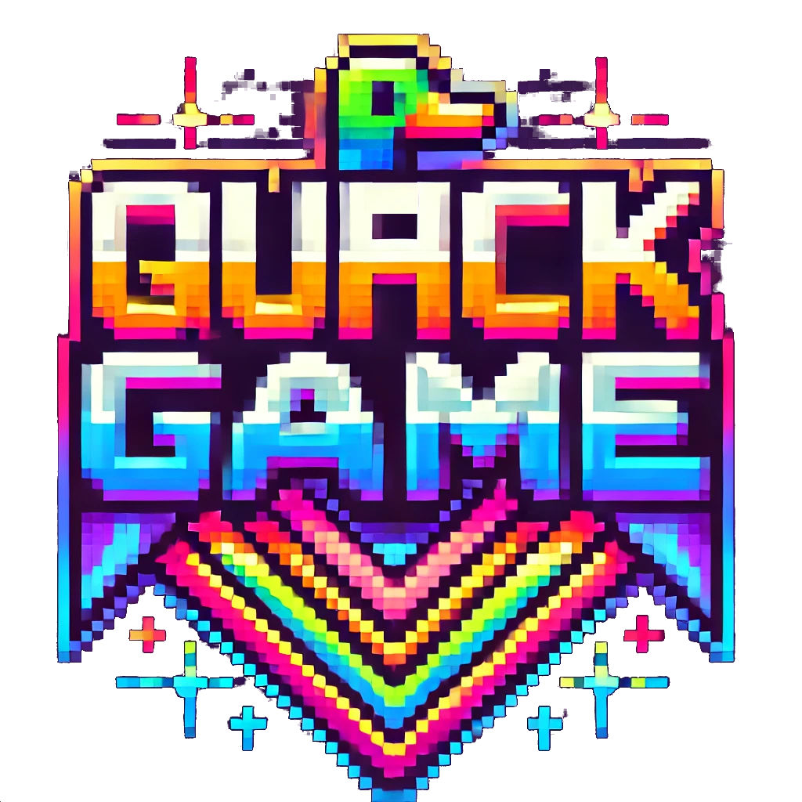

<div style="text-align: center;">
    <h1>Quack Game</h1>
    <p> Remake de Duck Game
    </p>
  
</div>


# Instalación

```
    git clone git@github.com:jmdieguez/QuackGame.git
    cd QuackGame
    ./install.sh
```

# Controles

* Apuntar hacia arriba: W
* Agacharse: S
* Moverse a la izquierda: A
* Moverse hacia la derecha: D
* Saltar: Espacio
* Agarrar un arma del suelo: E
* Disparar: T

# Cheats

* Escribir 'ak' para spawnear una AK-47
* Escribir 'sh' para spawnear una Shotgun

# Créditos

Realizado por

* Trinidad Bucciarelli

* José Manuel Dieguez

* Matias Rueda
